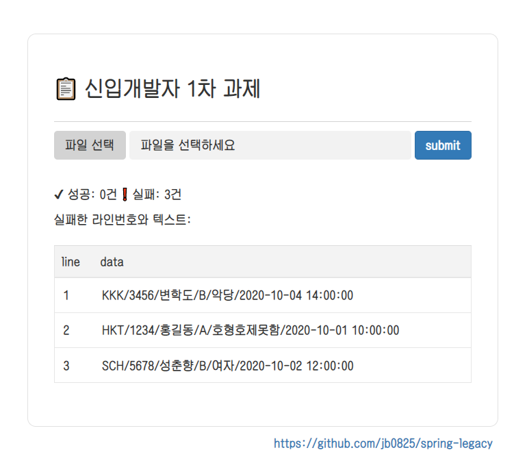
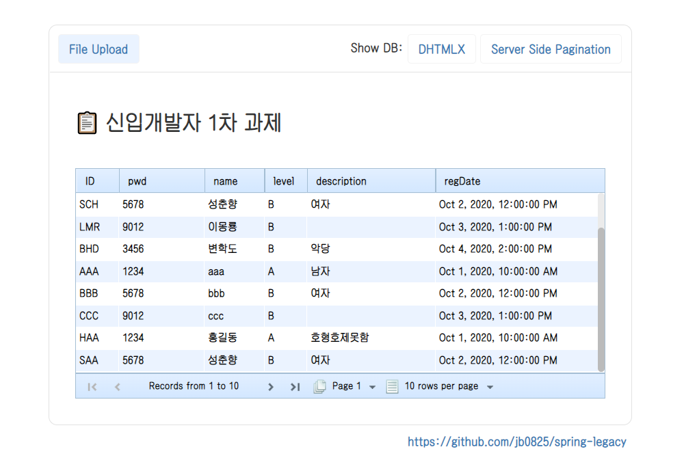

# Spring Legacy 프로젝트

Spring Legacy project with maven, mybatis, postgreSQL.

신입 개발자 과제 프로젝트입니다.


##1: Flie Upload & DHTMLX Grid 



##2: DHTMLX Suite5 적용 



#
SQL:
```postgresql
CREATE TABLE T_USER(
	id varchar(16) PRIMARY KEY NOT NULL,
	pwd VARCHAR(32) NOT NULL,
	name VARCHAR(128) NOT NULL,
	level CHAR(1) NOT NULL,
	description VARCHAR(256) NULL,
	reg_date TIMESTAMP NOT NULL
);
```
